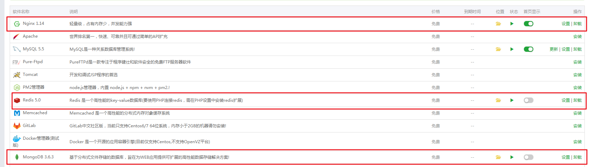

# 安装宝塔&宝塔安装插件部分

为了方便、快捷的安装PyOne，推荐使用宝塔面板进行操作！当然能力强者可参考本文手动安装软件。

### 安装宝塔

参考宝塔安装页面操作：[https://www.bt.cn/bbs/thread-1186-1-1.html](https://www.bt.cn/bbs/thread-1186-1-1.html)

### 宝塔安装插件

上面安装好宝塔面板，登录宝塔面板。初次安装会提示安装LNMP或者LAMP，我们只需要勾选：**Nginx**即可。

然后到**软件管理-运行环境-选择安装MongoDB和Redis**。

**总结本文**

1. 安装宝塔
2. 确保在宝塔已经安装了：`Nginx`、`Redis`、`MongoDB`。

