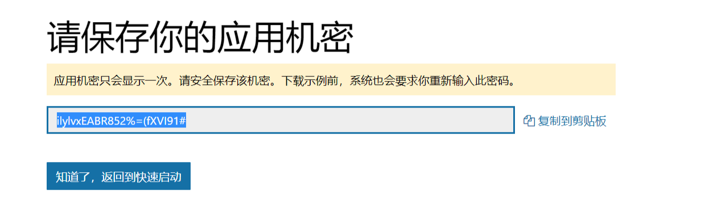
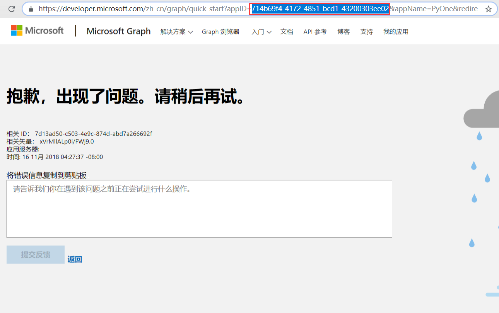
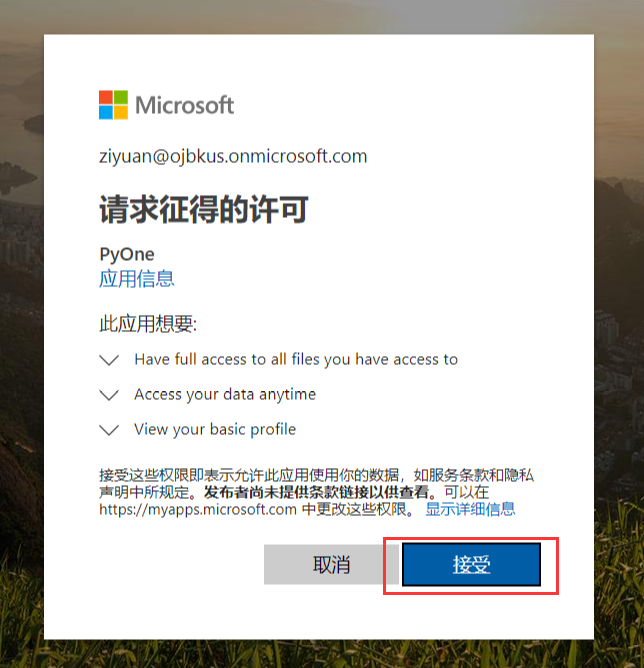

# 绑定网盘

上一篇已经介绍了怎么运行网站，本篇将介绍如何绑定网盘。

注意！！**首次访问**，会显示**登录后台**，输入初始密码：**PyOne，登陆后**后会自动跳转到绑定网盘页面。如果没有跳转到绑定网盘页面，可以按照：**后台-文件管理-添加网盘**进行下一步。

### 绑定网盘

#### 第一步：获取应用机密（client\_secret\)和应用ID（client\_id\)

1. 然后点击上方按钮获取**应用机密（client\_secret\)**，填写到**应用机密\(client\_secret\)**栏

2. 在刚才获取**应用机密（client\_secret\)**的页面，点击`知道了，返回到快速启动`，会出现错误，查看网址栏，找到**appID**这一个参数，这个参数就是**应用ID（client\_id\)**\(目前修复了，可直接获取），将**appID**复制到上方**应用**ID**\(client\_id\)**栏

3. 填写完上方两个参数，继续**下一步**

#### 第二步：获取验证码并结束绑定

步骤1：点击**绑定账号**，并跳转到绑定页面

步骤2：选择需要绑定的账号，进入下一步

步骤3：接收认证许可，获取一个code，将这个code填写到**code栏**后，点击**结束绑定**

#### 绑定成功

如果没有出现错误，则会进入以下页面。

### 安装预览

### 错误指导

如果在绑定网盘过程中，出现错误，可以按照以下内容进行排查：

1. 确保正确获取了client\_id和client\_secret
2. 确保正确填写了client\_id和client\_secret
3. 一般来说，第一遍不成功，可以从头再来一遍流程！

