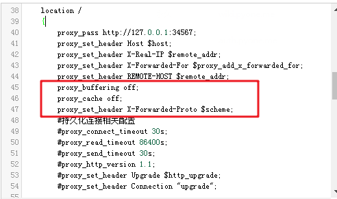

# 绑定域名

1. 先确保域名已经解析到你的服务器ip
2. 打开宝塔-**网站-添加站点**
3. 设置反代：**宝塔-网站-点击域名-反向代理**，设置值`http://127.0.0.1:34567`然后勾选`启用反向代理`
4. 添加nginx配置：**宝塔-网站-点击域名-配置文件**。找到以下内容，添加以下三行。

```text
location / 
    {
        ...
        
        proxy_buffering off;
        proxy_cache off;
        proxy_set_header X-Forwarded-Proto $scheme;
                
        ...
    }
```

**如图**




做完以上操作，应该就可以访问你的域名了！


