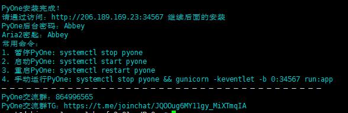

# 下载源码&一键安装

2018.11.19更新之后，新增了一键配置脚本。

一键脚本主要配置以下内容：

1. **自动安装依赖包**；
2. 配置**self\_config.py**和**supervisord.conf**；
3. 配置**开机启动**；
4. **自动安装aria2**；

### 开始安装

> 默认在**/root**目录下进行操作！

#### 下载源码

```text
git clone https://github.com/abbeyokgo/PyOne.git
```

#### 使用一键安装脚本

```text
cd PyOne
bash install.sh
```

然后按照提示进行操作！

安装过程中会要求输入：**MongoDB端口号（27017）、Redis端口号（6379）、Aria2密钥、PyOne后台密码**

安装完成提示



安装过程中，会**安装aria2**，用于做onedrive网盘**离线下载**功能。

在安装aria2的过程中，需要**设置用户名和密码**；

1. 用户名、密码用于**登录YAAW管理界面**；
2. 密码还用于aria2c的**secret**，需在**PyOne后台-基本设置-Aria2信息编辑**里面**设置该密码**。

### 运行网站

使用一键安装脚本，并检查文件无误之后，运行下面的命令运行网站

```text
supervisord -c supervisord.conf
```

然后看看是否可以访问：`http://ip:34567`

确保已经开启`34567`端口。

