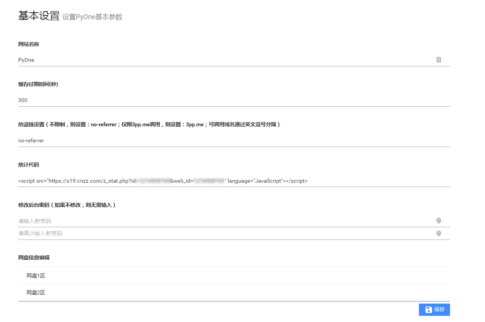
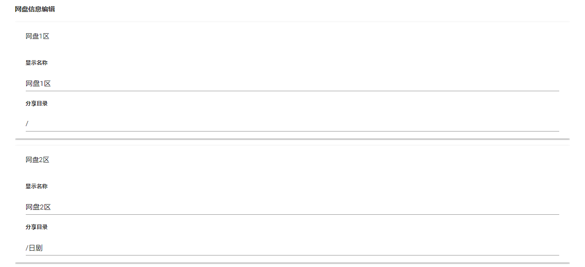

# 基本设置

先看一看**基本设置**的页面。

### 网站名称

网站名称为**title**标签显示的部分

### 缓存过期时间\(秒\)

通过onedrive api获取的文件直链都是有过期时间的，但是官方文档里面没有明确这个过期时间具体是多少，这边之前测试的时候大概10分钟左右都还没有过期，为了保险，这边设置了一个300s的期限。

也就是说当用户访问了一个文件，后台自动获取了这个文件的直链起，当另一个用户300s内访问这个文件都不会重新再获取文件直链；

### 防盗链设置

此项帮助PyOne使用者，防止其他人直接调用资源。

1. 如果只允许**pyone.me**调用资源，则设置为：`pyone.me`
2. 如果允许多个域名调用资源，则设置为（注意用英文）：`pyone.me,pytwo.me,pythree.me`
3. 如果不限制域名，则设置为：`no-referrer`

### 统计代码

设置统计代码，可放cnzz、百度统计、谷歌统计等代码。需要合并成一行代码

### 修改后台密码

连续输入两边密码进行确定修改密码操作

### 网盘信息编辑

绑定了多少个网盘，就会显示多少个网盘。

可设置：

1. **显示名称**：即网站顶部显示的名称。
2. **分享目录**：设置分享onedrive的哪个目录。
   1. 如果全盘分享，则设置为：`/`
   2. 如果分享特定目录，比如分享`日剧`这个目录，则设置为：`/日剧`

最后点击**保存**按钮就行保存。如果设置了supervisor启动网站，则自动重启网站，如果是命令行运行的，则需要手动停止再运行网站，才能生效。

