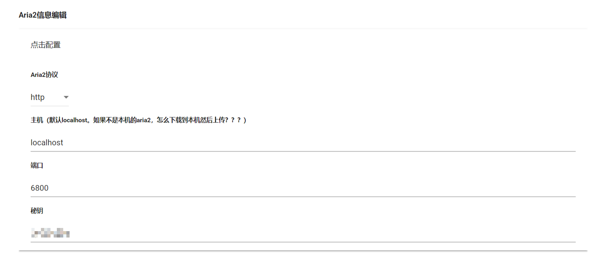

# Aria2信息编辑

**Aria2设置**

1. **Aria2协议**

   默认是**`http`**，如果你的aria2设置了**`https`**，可选**`https`**。

2. **主机地址**

   这个**必须是`localhost`或者`127.0.0.1`**。其他机器的aria2无法用于离线下载。

3. **端口**

   aria2默认端口是**`6800`**，如果设置了其他端口，请设置为对应端口号。

4. **秘钥**

   在前面的安装过程中，有安装aria2，然后设置一个密码，该密码用于此处。

   * 如果你是自己安装的aria2，请确保使用了`rpc-secret`验证模式。
   * 如果你**没有设置`rpc-secret`**，也**没有设置`rpc-username`和`rpc-password`**，则此处**留空**。

