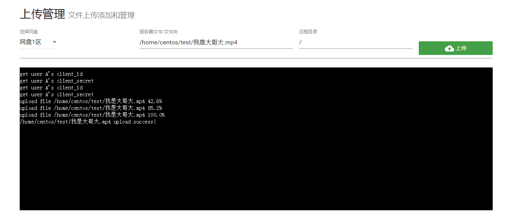
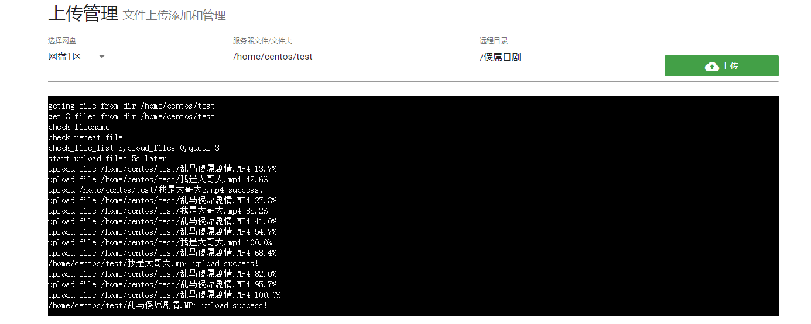

# 上传文件

本文介绍如何上传服务器的文件到onedrive。

### 选项介绍

1. **选择网盘**：选择要上传到哪个网盘。这里只显示已经绑定的网盘
2. **服务器文件/文件夹**：需要填写当前服务器存在的一个目录或者文件的绝对路径。
   1. 如果填写的是**文件路径**：则上传单个文件到onedrive
   2. 如果填写的是**目录路径**：则上传该目录下的所有文件到onedrive
3. **远程目录**：即需要上传到的onedrive目录。默认上传到根目录，即：`/`

   1. 如果该**目录已经存在**：则直接上传到这个文件夹。
   2. 如果该**目录不存在**：则onedrive自动创建文件夹。

   **远程目录这里需要注意**的是：

   1. 如果你要上传到onedrive的某个目录下，**目录最后面一定要带`/`**！！否则远程目录会认定为一个文件！比如我要上传文件到onedrive的`日剧`目录下，则远程目录要设置为：`/日剧/`
   2. 如果你要上传到onedrive的某个目录后**重命名文件，**则直接设置为远程目录文件名路径。比如我要上传`1.mp4`，然后上传到根目录并重命名为`2.mp4`，则远程目录要设置为：`/2.mp4`

4. 点击**上传**之后，自动上传，并在本地目录显示该文件，**无需更新缓存**！

#### 上传单文件

#### 批量上传文件

