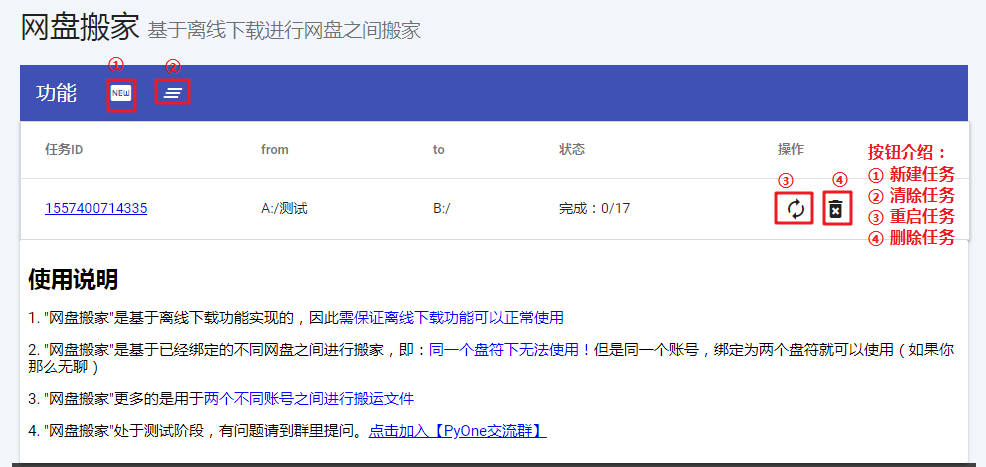

# 网盘搬家

**网盘搬家介绍**

1. "网盘搬家"是基于离线下载功能实现的，因此需保证离线下载功能可以正常使用

2. "网盘搬家"是基于已经绑定的不同网盘之间进行搬家，即：同一个盘符下无法使用！但是同一个账号，绑定为两个盘符就可以使用（如果你那么无聊）

3. "网盘搬家"更多的是用于两个不同账号之间进行搬运文件

4. "网盘搬家"处于测试阶段，有问题请到群里提问。[点击加入【PyOne交流群】](https://jq.qq.com/?_wv=1027&k=5iEq8F0)

**预览界面**

