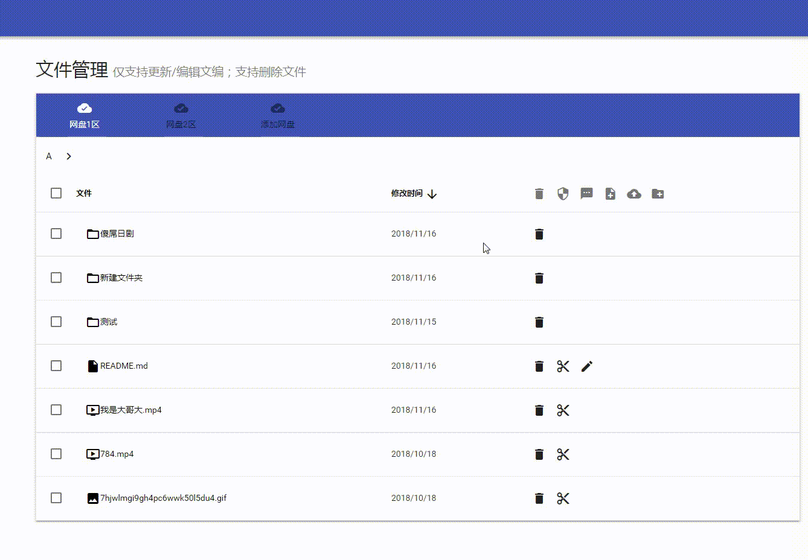

# 上传本地文件

这个功能区别于上面的上传文件功能。这个功能是**上传本地文件到onedrive（通过服务器中转）**，而上面的上传文件功能则是直接上传服务器文件到onedrive。

**上传方法**：

1. 在需要上传文件的文件夹下，点击**上传文件按钮**，跳转到**上传文件界面**
2. 可点击上传按钮**选择文件**，也可以**拖拽文件**进来
3. 点击**开始上传**，即开始上传文件。

