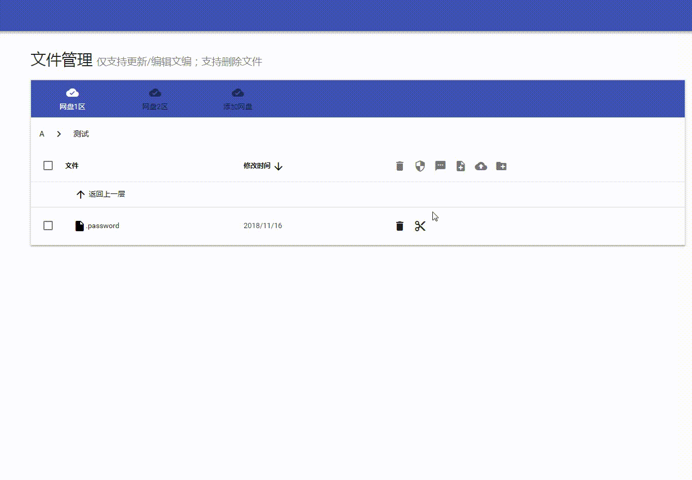

# 设置密码、README、HEAD

在文件管理下，有三个按钮，分别是：**设置密码、设置README、设置HEAD**。

在当前目录下点击这三个目录，就代表在当前目录下设置。

如果当前目录以及存在密码、README、HEAD，点击按钮之后则会进入编辑模式。

### 设置密码

设置密码可以给当前文件夹加密，如果你不希望用户访问当前目录，则可以设置一个密码。当其他用户访问这个文件夹时需要验证密码才能进入。

### 设置README/HEAD

设置**README**后，当前目录下方就会显示内容。**README**可以设置一些文件说明、使用说明等。

设置**HEAD**后，当前目录上方就会显示内容。**HEAD**可以设置公告之类的内容。

