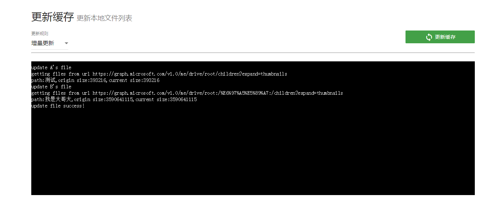
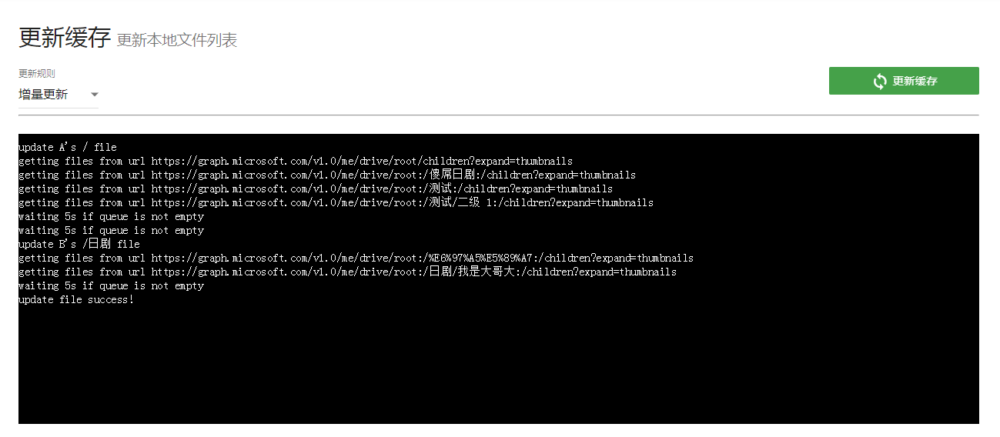

# 更新列表

本功能主要是在通过其他方法上传了文件到onedrive后，更新文件列表。

### 选项介绍

1. **更新规则**
   * **增量更新**：通过检测本地目录和远程目录的大小，只有在远程目录的大小发生变化的时候才进行更新文件列表操作，否则不更新！
   * **全量更新**：直接清除本地文件列表，并全盘更新文件列表！
2. 如果**远程文件夹结构没有发生变化**，推荐使用**增量更新**！如果**远程文件夹结构发生了变化**，推荐使用**全量更新**！

ps. 目前更新列表功能已经没有实时进度显示！

#### 增量更新

* 未接测到新增文件

#### 全量更新

